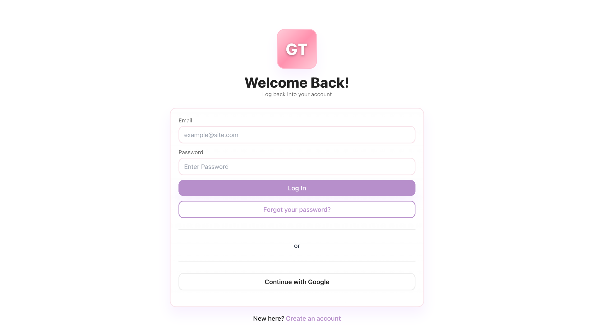
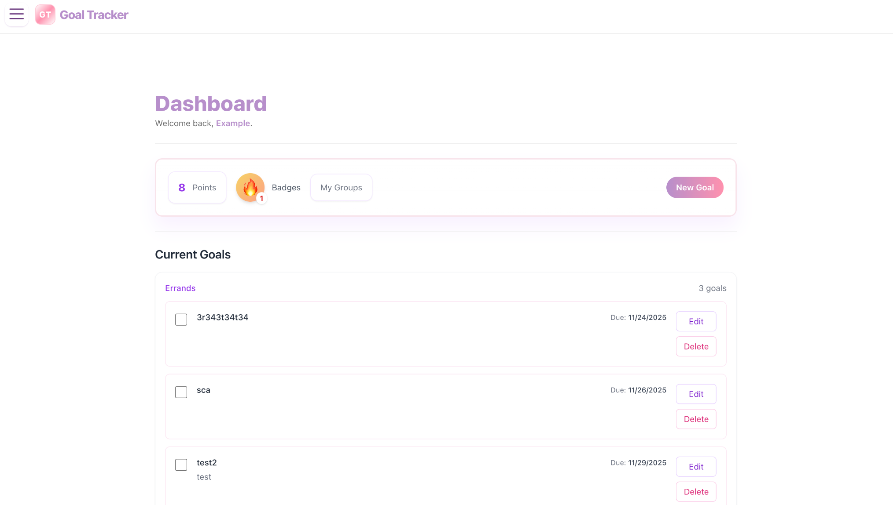
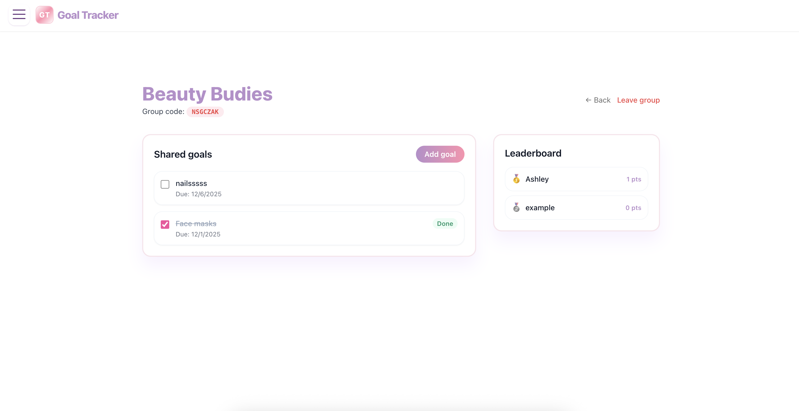

# **GoalTracker ✨**

A clean React + Vite app to create, organize, and complete your goals. Finishing goals earns points and unlocks badges. Organize by category for easy focus.

✨ Features

➕ Create, ✏️ edit, 🗑️ delete goals

✅ Mark goals as completed (earns 1 point)

🗂️ Categories for grouping/filtering

🏅 Badges (simple logic, easy to extend)

🎨 Tailwind UI, minimal and responsive

🧭 Branches

This repo uses three working branches: ash_code, eg_code, and main.

🚀 Quick Start
# 1) install
npm install

# 2) run dev server
npm run dev

# 3) build / preview
npm run build
npm run preview

🔐 Environment (.env)

Create a .env (or .env.local) at the project root with your Firebase web credentials. 

# Firebase Web App ( use *your* values)
VITE_FIREBASE_API_KEY = your credentials
VITE_FIREBASE_AUTH_DOMAIN = your credentials
VITE_FIREBASE_PROJECT_ID = your credentials
VITE_FIREBASE_STORAGE_BUCKET = your credentials
VITE_FIREBASE_MESSAGING_SENDER_ID = your credentials
VITE_FIREBASE_APP_ID = your credentials
VITE_FIREBASE_MEASUREMENT_ID = your credentials

🗂️ Project Structure (high level)
src/
  components/   # UI pieces like GoalForm, GoalList, BadgePanel, CategoryFilter
  hooks/        # useGoals, etc.
  context/      # Auth context
  firebase.js   # app/bootstrap
  App.jsx
  main.jsx
public/

🧱 Data Model (example)
{
  "title": "Study Chapter 5",
  "notes": "Focus on proofs",
  "category": "School",
  "dueDate": "2025-11-20T00:00:00.000Z",
  "completed": false,
  "createdAt": "serverTimestamp",
  "updatedAt": "serverTimestamp",
  "pointsAwarded": 0
}

🖼️ Screenshots

**Login**

**Dashboard**

**🏆 Leaderboard**

